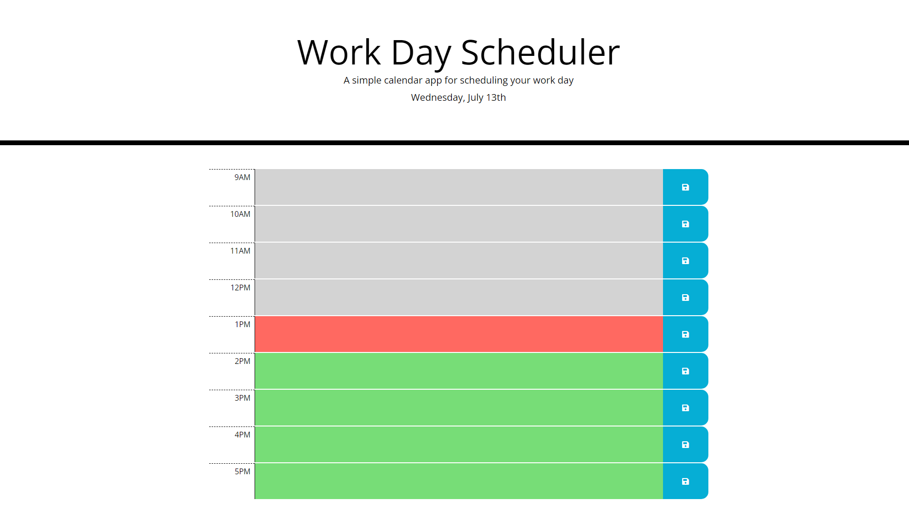

# Work-Day-Scheduler

## Description

- My motivation in completing this project was to apply what I learned this week about Moment.js, Bootstrap, and jQuery.

- I built this project because I wanted to test my skills and see if I could recreate the mock-up correctly.

- The main problems solved while working on this project were getting the input to save on click/refresh and getting the time slot colors to change based on the time of day. 

- Through this project I learned more about applying for-loops and how to select multiple buttons to do the same function. 

- The challenge I faced was figuring out how to make each button save it's own description without writing a code novel. Also, I struggled with getting the for-loop to work the way I wanted. Stack Overflow helped me a lot with this. 

## Website Appearance 

## Deployed Application Link: 

https://srandall1213.github.io/Work-Day-Scheduler/